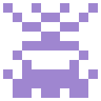
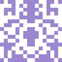

# Identigo
This is a small project from two years ago I did to get acquainted with Go. 
This module allows generating identicons for a given string. You can also specify the picture's size and amount of pixels used. 

## Examples
*64x64 with a 6px side ("rainbow")*
*128x128 with a 10px side ("test")*
*128x128with a 16px side ("test")*
*128x128 with a 18px side ("github")*
